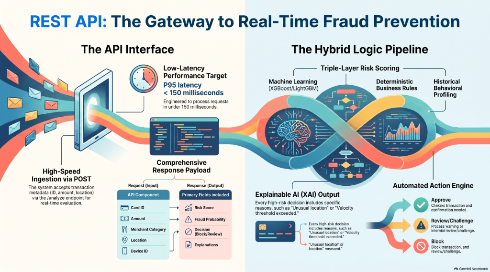

# FraudGuard AI — REST API Reference Manual

**Base URL**: `http://localhost:8000` (or configured `VITE_API_BASE_URL`)  
**Specification**: OpenAPI 3.1.0  
**Interactive Docs**: `http://localhost:8000/docs` (Swagger UI) / `http://localhost:8000/redoc` (ReDoc)



---

## Endpoints Summary

| Method | Path | Description | Authentication |
| :--- | :--- | :--- | :---: |
| `POST` | `/api/transactions/analyze` | Full transaction analysis, hybrid risk scoring, and persistence | None (Demo) |
| `POST` | `/predict` | Pure ML feature inference returning raw fraud probability | None (Demo) |
| `GET` | `/api/transactions` | Retrieves historical transaction audit logs (newest first) | None (Demo) |
| `GET` | `/api/stats` | Retrieves aggregated portfolio KPI metrics | None (Demo) |
| `GET` | `/api/model/metrics` | Retrieves candidate vs. baseline ML performance benchmarks | None (Demo) |
| `GET` | `/api/health` | Service health check | None (Demo) |

---

## 1. Analyze Transaction

### `POST /api/transactions/analyze`

Executes the primary end-to-end evaluation pipeline: extracts features, executes ML model inference, runs secondary deterministic business rules, calculates the hybrid risk score, generates plain-English explanations, and saves the record to SQLite.

#### Request Headers
| Header | Value | Required |
| :--- | :--- | :---: |
| `Content-Type` | `application/json` | Yes |

#### Request Body Schema
```json
{
  "cardId": "string (default: 'CARD001')",
  "amount": "float (> 0, required)",
  "merchant": "string (default: 'Online Merchant')",
  "merchantRisk": "string (enum: 'LOW' | 'MEDIUM' | 'HIGH')",
  "transactionHour": "integer (0–23, default: 12)",
  "transactionsLast10Minutes": "integer (>= 0, default: 1)",
  "averageTransactionAmount": "float (> 0, default: 2500.0)",
  "newDevice": "boolean (default: false)",
  "newLocation": "boolean (default: false)"
}
```

#### Example cURL
```bash
curl -X POST "http://localhost:8000/api/transactions/analyze" \
  -H "Content-Type: application/json" \
  -d '{
    "cardId": "CARD003",
    "amount": 75000,
    "merchant": "Crypto Exchange X",
    "merchantRisk": "HIGH",
    "transactionHour": 3,
    "transactionsLast10Minutes": 8,
    "averageTransactionAmount": 2500,
    "newDevice": true,
    "newLocation": true
  }'
```

#### Successful Response (`200 OK`)
```json
{
  "id": 52,
  "timestamp": "2026-09-03 14:40:12",
  "cardId": "CARD003",
  "amount": 75000.0,
  "merchant": "Crypto Exchange X",
  "merchantRisk": "HIGH",
  "fraudProbability": 1.0,
  "mlScore": 70.0,
  "ruleScore": 30.0,
  "riskScore": 100,
  "riskLevel": "CRITICAL",
  "decision": "BLOCK",
  "reasons": [
    "Transaction amount (₹75,000) is 30.0× the customer's historical average (₹2,500).",
    "High velocity anomaly: 8 transactions attempted within the last 10 minutes.",
    "New/unrecognized device fingerprint detected for this cardholder.",
    "Unusual transaction geographic location outside regular cardholder perimeter.",
    "High-risk merchant terminal category (frequent target for fraudulent chargebacks).",
    "Off-hours nocturnal activity (3:00 AM) combined with elevated amount."
  ],
  "factorContributions": [
    {
      "factor": "Amount Deviation",
      "impact": "CRITICAL",
      "scoreContribution": 35.0,
      "description": "30.0× customer average"
    },
    {
      "factor": "Velocity (10m)",
      "impact": "HIGH",
      "scoreContribution": 24.0,
      "description": "8 txns in 10 mins"
    },
    {
      "factor": "Device Novelty",
      "impact": "HIGH",
      "scoreContribution": 20.0,
      "description": "Unrecognized device"
    },
    {
      "factor": "Location Novelty",
      "impact": "MEDIUM",
      "scoreContribution": 15.0,
      "description": "Unfamiliar location"
    },
    {
      "factor": "Merchant Risk",
      "impact": "HIGH",
      "scoreContribution": 15.0,
      "description": "HIGH risk category"
    },
    {
      "factor": "Time Anomaly",
      "impact": "MEDIUM",
      "scoreContribution": 10.0,
      "description": "Nocturnal hour (3:00 AM)"
    }
  ],
  "triggeredRules": [
    {
      "id": "RULE_1_LARGE_AMOUNT",
      "name": "Large Transaction",
      "points": 15,
      "description": "Transaction amount (₹75,000) is 30.0x the customer's average (₹2,500)."
    },
    {
      "id": "RULE_2_NEW_DEVICE_HIGH_VALUE",
      "name": "High-Value Transaction on New Device",
      "points": 15,
      "description": "Unrecognized device executing transaction exceeding ₹50,000 threshold."
    },
    {
      "id": "RULE_3_HIGH_VELOCITY",
      "name": "Rapid Transaction Velocity",
      "points": 20,
      "description": "8 transactions detected in the last 10 minutes (velocity threshold > 5)."
    },
    {
      "id": "RULE_4_NEW_LOCATION",
      "name": "Unusual Location",
      "points": 10,
      "description": "Transaction originated from a previously unseen geographic location or IP zone."
    },
    {
      "id": "RULE_5_HIGH_RISK_MERCHANT",
      "name": "High-Risk Merchant Category",
      "points": 10,
      "description": "Merchant is classified in a high-risk sector (e.g., luxury goods, cryptocurrency, gaming)."
    }
  ]
}
```

---

## 2. Pure ML Prediction

### `POST /predict`

Standard lightweight microservice inference endpoint as defined in PRD Section 17. Returns solely the machine-learning probability estimation without business rule synthesis or database writes.

#### Request Body
```json
{
  "features": {
    "amount": 75000,
    "transactionHour": 3,
    "transactionsLast10Minutes": 8,
    "averageTransactionAmount": 2500,
    "newDevice": true,
    "newLocation": true,
    "merchantRisk": "HIGH"
  }
}
```

#### Example cURL
```bash
curl -X POST "http://localhost:8000/predict" \
  -H "Content-Type: application/json" \
  -d '{"features": {"amount": 75000, "transactionHour": 3, "transactionsLast10Minutes": 8, "averageTransactionAmount": 2500, "newDevice": true, "newLocation": true, "merchantRisk": "HIGH"}}'
```

#### Successful Response (`200 OK`)
```json
{
  "fraudProbability": 1.0
}
```

---

## 3. Retrieve Transaction History

### `GET /api/transactions`

Retrieves audit history sorted chronologically descending (newest transactions first).

#### Query Parameters
| Parameter | Type | Default | Description |
| :--- | :---: | :---: | :--- |
| `limit` | `integer` | `100` | Maximum records to return (min: 1, max: 500) |

#### Example cURL
```bash
curl -X GET "http://localhost:8000/api/transactions?limit=10"
```

#### Successful Response (`200 OK`)
```json
[
  {
    "id": 52,
    "timestamp": "2026-09-03 14:40:12",
    "cardId": "CARD003",
    "amount": 75000.0,
    "merchant": "Crypto Exchange X",
    "merchantRisk": "HIGH",
    "transactionHour": 3,
    "transactionsLast10Minutes": 8,
    "averageTransactionAmount": 2500.0,
    "newDevice": true,
    "newLocation": true,
    "fraudProbability": 1.0,
    "mlScore": 70.0,
    "ruleScore": 30.0,
    "riskScore": 100,
    "riskLevel": "CRITICAL",
    "decision": "BLOCK",
    "reasons": [ ... ],
    "factorContributions": [ ... ],
    "triggeredRules": [ ... ]
  }
]
```

---

## 4. Retrieve Dashboard KPI Statistics

### `GET /api/stats`

Returns aggregated portfolio metrics across all evaluated transactions.

#### Example cURL
```bash
curl -X GET "http://localhost:8000/api/stats"
```

#### Successful Response (`200 OK`)
```json
{
  "totalTransactions": 52,
  "fraudDetected": 14,
  "blocked": 9,
  "underReview": 5,
  "approved": 38,
  "fraudRatePercentage": 26.9,
  "averageRiskScore": 21.3
}
```

---

## 5. Retrieve Model Performance Benchmarks

### `GET /api/model/metrics`

Returns comparative evaluation metrics generated during offline model training (PRD Section 24).

#### Example cURL
```bash
curl -X GET "http://localhost:8000/api/model/metrics"
```

#### Successful Response (`200 OK`)
```json
{
  "dataset": {
    "total_records": 20000,
    "train_records": 16000,
    "test_records": 4000,
    "fraud_count": 800,
    "legit_count": 19200
  },
  "feature_columns": [
    "amount",
    "average_transaction_amount",
    "amount_deviation",
    "transaction_hour",
    "transaction_day",
    "transactions_last_10_minutes",
    "transaction_frequency",
    "is_new_device",
    "is_new_location",
    "merchant_risk"
  ],
  "baseline": {
    "model_name": "Logistic Regression (Baseline)",
    "accuracy": 0.956,
    "precision": 0.4759,
    "recall": 0.9875,
    "f1": 0.6423,
    "roc_auc": 0.9966,
    "confusion_matrix": [[3666, 174], [2, 158]]
  },
  "candidate": {
    "model_name": "XGBoost (Candidate)",
    "accuracy": 0.9818,
    "precision": 0.69,
    "recall": 0.9875,
    "f1": 0.8123,
    "roc_auc": 0.9987,
    "confusion_matrix": [[3769, 71], [2, 158]]
  },
  "comparison": {
    "f1_improvement": 0.17,
    "roc_auc_improvement": 0.0021,
    "recall_improvement": 0.0
  }
}
```

---

## 6. Service Health Check

### `GET /api/health`

Returns operational liveness status for orchestration probes and load balancers.

#### Response (`200 OK`)
```json
{
  "status": "ok",
  "service": "fraud-detection-api"
}
```
