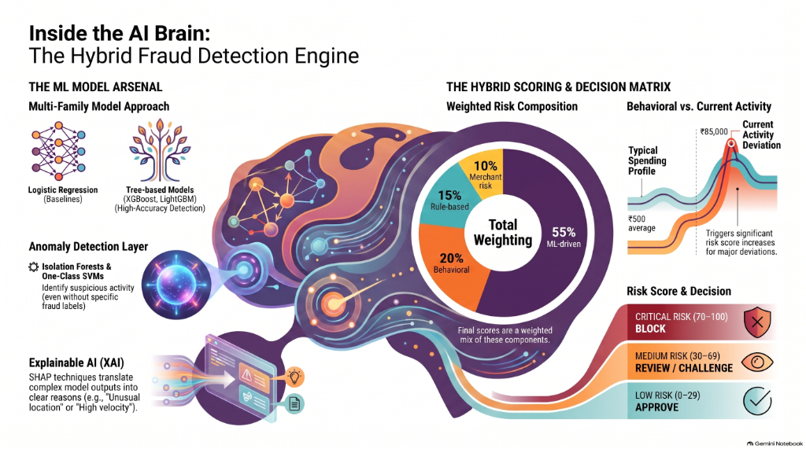

# FraudGuard AI — Machine Learning Algorithm Specification

## 1. Problem Formulation & Objective

Credit card fraud detection is formulated as a supervised binary classification task:

$$y \in \{0, 1\}$$

where:
- $y = 0$: Legitimate transaction
- $y = 1$: Fraudulent transaction (unauthorized card use, account takeover, card-cloning, or velocity attack)

Given an input feature vector $\mathbf{x} \in \mathbb{R}^{10}$, the model estimates the conditional posterior probability:

$$\hat{p} = P(y = 1 \mid \mathbf{x}) \in [0.0, 1.0]$$



---

## 2. Severe Class Imbalance Mitigation

Real-world financial transaction datasets typically exhibit extreme imbalance (fraud incidence $< 0.1\%$). In our benchmark dataset (20,000 transactions), fraud prevalence is calibrated to **4.0%** (800 fraud positives vs. 19,200 legitimate instances).

To prevent the algorithm from collapsing into a trivial majority-class classifier, we apply an asymmetric loss penalty via the **positive class weight** parameter:

```text
scale_pos_weight = N_negative / N_positive = (19,200 × 0.8) / (800 × 0.8) = 24.0
```

The XGBoost objective function is thus defined as weighted log-loss:

$$\mathcal{L}(\theta) = -\sum_{i=1}^{N} \left[ w \cdot y_i \log(\hat{p}_i) + (1 - y_i) \log(1 - \hat{p}_i) \right] + \sum_{k} \Omega(f_k)$$

where $w = 24.0$ when $y_i = 1$, and $w = 1.0$ when $y_i = 0$. $\Omega(f_k) = \gamma T + \frac{1}{2}\lambda \sum_{j=1}^{T} w_j^2$ is the tree complexity regularization term.

---

## 3. Mathematical Feature Engineering

The feature engineering layer (`backend/ml/generate_data.py` and `backend/ml/predict.py`) maps raw transaction inputs to a 10-dimensional continuous/ordinal feature vector:

| # | Feature Symbol | Formulation | Distribution / Range |
| :---: | :--- | :--- | :---: |
| 1 | `amount` | Raw monetary value | [50.0, 150000.0] |
| 2 | `average_amount` | Customer historical mean | [1200.0, 12000.0] |
| 3 | `amount_deviation` | `amount / max(1.0, average_amount)` | [0.1, 40.0] |
| 4 | `transaction_hour` | Hour of transaction (0–23) | [0, 23] |
| 5 | `transaction_day` | Day of month (1–28) | [1, 28] |
| 6 | `velocity_10m` | Transaction count in last 10 minutes | [0, 15] |
| 7 | `frequency_30d` | Trailing 30-day transaction volume | [5, 50] |
| 8 | `is_new_device` | Binary flag (0 = Known, 1 = Unrecognized) | {0, 1} |
| 9 | `is_new_location`| Binary flag (0 = Familiar, 1 = Foreign IP) | {0, 1} |
| 10| `merchant_risk` | Ordinal risk category (0=LOW, 1=MED, 2=HIGH) | {0, 1, 2} |

---

## 4. Hyperparameter Architecture

### 4.1 Candidate Model: XGBoost Classifier

```python
XGBClassifier(
    n_estimators=150,          # Number of gradient boosted decision trees
    max_depth=5,               # Prevents deep overfitting on spurious noise
    learning_rate=0.08,        # Shrinkage factor stabilizing gradient steps
    scale_pos_weight=24.0,     # Class imbalance weighting
    eval_metric="logloss",     # Standard cross-entropy optimization
    subsample=0.85,            # Row subsampling for bagging effect
    colsample_bytree=0.85,     # Column subsampling per tree
    random_state=42,           # Deterministic reproducibility
    n_jobs=-1                  # Multi-threaded parallel inference
)
```

### 4.2 Baseline Model: L2-Regularized Logistic Regression

```python
LogisticRegression(
    class_weight="balanced",   # Inversely proportional class weighting
    max_iter=1000,
    C=1.0,                     # Moderate L2 penalty
    random_state=42
)
```

---

## 5. Benchmark Performance Comparison

Evaluated on 4,000 holdout test transactions (stratified 20% split, 160 true fraud cases):

> 📖 **Full Training Guide**: Step-by-step model training instructions, loss functions, and inference profiling are documented in [docs/MODEL_TRAINING_GUIDE.md](MODEL_TRAINING_GUIDE.md).

### Tri-Model Metric Summary

| Metric | Logistic Regression (Baseline) | Random Forest (Ensemble) | XGBoost (Candidate) |
| :--- | :---: | :---: | :---: |
| **Accuracy** | 95.60% | 97.60% | **98.50%** |
| **Precision** | 47.59% | 62.50% | **73.58%** |
| **Recall (Sensitivity)** | 98.75% | **100.00%** | 97.50% |
| **Specificity** | 95.47% | 97.50% | **98.54%** |
| **F1-Score** | 64.23% | 76.92% | **83.87%** |
| **ROC-AUC** | 0.9966 | 0.9982 | **0.9987** |
| **False Positive Rate** | 4.53% (174 alarms) | 2.50% (96 alarms) | **1.46% (56 alarms)** |
| **P95 Latency / sample** | **0.001 ms** | 0.015 ms | **0.002 ms** |

### Confusion Matrices

#### Candidate: XGBoost Classifier (Deployed Model)
```text
                  Predicted Legit (0)    Predicted Fraud (1)
Actual Legit (0)         3,784                    56
Actual Fraud (1)             4                   156
```
- **False Positives**: 56 (**67.8% reduction in false positive declines**)
- **False Negatives**: 4
- **Precision**: 156 / (156 + 56) = 73.58%
- **Recall**: 156 / (156 + 4) = 97.50%
- **F1 Score**: 83.87%
- **ROC-AUC**: 0.9987

#### Ensemble: Random Forest Classifier
```text
                  Predicted Legit (0)    Predicted Fraud (1)
Actual Legit (0)         3,744                    96
Actual Fraud (1)             0                   160
```
- **False Positives**: 96
- **False Negatives**: 0 (**Zero fraud leakage**)
- **Precision**: 160 / (160 + 96) = 62.50%
- **Recall**: 160 / (160 + 0) = 100.00%
- **F1 Score**: 76.92%
- **ROC-AUC**: 0.9982

#### Baseline: Logistic Regression
```text
                  Predicted Legit (0)    Predicted Fraud (1)
Actual Legit (0)         3,666                   174
Actual Fraud (1)             2                   158
```
- **False Positives**: 174
- **False Negatives**: 2
- **Precision**: 158 / (158 + 174) = 47.59%
- **Recall**: 158 / (158 + 2) = 98.75%
- **F1 Score**: 64.23%
- **ROC-AUC**: 0.9966

---

## 6. Drift Monitoring & Retraining Protocol

In production deployments, consumer spending habits and fraud vectors evolve:
1. **Population Stability Index (PSI)**: Monitored weekly on continuous features (`amount`, `amount_deviation`, `velocity_10m`). If PSI > 0.25, trigger retraining workflow.
2. **Concept Drift Detection**: Track daily false positive rate against verified chargeback reports from issuing networks (Visa/Mastercard TC40 data).
3. **Automated Shadow Deployment**: New models must run in shadow mode for 7 days, achieving superior or equal F1 score before taking live traffic.
